<h3><code>The Cipher Stack</code></h3>

<table><tr><td valign="top"></td><td valign="top"></td></tr></table>

# 👋 Seraj Haidar Rain
### Computer Science Student • Full-Stack Developer • AI/ML Enthusiast

---

<h3><code>Contributions</code></h3>

<h3><code>Featured Gallery</code></h3>
<table><tr>
<td width="50%"><a href="https://github.com/serajhaider"><b>🏏 Cricket Analytics & Prediction</b></a> AI/ML + web dashboard for cricket analytics, player performance and prediction.</td>
<td width="50%"><a href="https://github.com/serajhaider"><b>🏠 Nepal House Price Prediction</b></a> Python-based ML regression project for Nepal house-price prediction.</td>
</tr><tr>
<td><a href="https://github.com/serajhaider"><b>🎬 Movie Database</b></a> React/Vite movie application with API-driven data.</td>
<td><a href="https://github.com/serajhaider"><b>🚗 Nepal Ride Hub</b></a> PHP/MySQL database-driven ride platform.</td>
</tr></table>

<h3><code>Tech Arsenal</code></h3>
**Frontend / 3D**  React · Next.js · TypeScript · Vite · Tailwind CSS · Three.js · Flutter  
**Backend / Database**  Node.js · Express.js · Python · Flask · PHP · MySQL  
**AI / Data**  Pandas · NumPy · Scikit-learn · XGBoost · Data Visualization  
**Tools / DevOps**  Git · GitHub · Docker · n8n · VS Code · Postman · Netlify

<h3><code>What I'm Up To</code></h3>
| Focus | Current Work |
|---|---|
| 🏗️ Building | Cricket analytics + ML FYP and full-stack applications |
| 🧠 Learning | Data Science, AI/ML, predictive analytics, APIs, Docker & automation |
| 🎯 Goal | Become internship-ready in AI/ML and Data Science |
| 🇳🇵 Base | Kathmandu, Nepal |

<h3><code>Achievements</code></h3>
<a href="https://github.com/serajhaider?tab=achievements">🏆 GitHub Achievements</a> · Pair Extraordinaire · Pull Shark · YOLO · Starstruck

<h3><code>Socials</code></h3>

<!-- Add verified LinkedIn / Instagram / Facebook / email URLs here. -->

